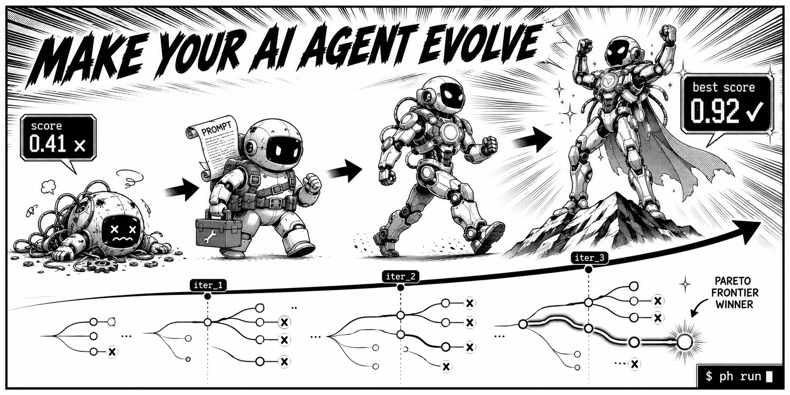

# PolyHarness



**Make your AI Agent evolve automatically.**

[](LICENSE)
[](https://www.python.org/downloads/)
[](https://github.com/weijt606/polyharness/actions/workflows/ci.yml)
[](README_CN.md)

---

> **What is a "harness"?**
> A harness is the code that wraps your AI agent's interaction with a task — including the prompt template, tool configuration, output parsing logic, and any pre/post-processing steps. It's the *how* your agent solves a problem, not the model itself. PolyHarness iteratively searches for better harness configurations so you don't have to tune them by hand.

Your AI agent runs the same harness every time. Same prompts, same tool config, same strategy — no matter how many times it fails.

**PolyHarness addresses that.** It records each iteration, evaluates candidate harness changes, and uses the accumulated history to search for better-scoring configurations. You run one command to start the loop.

| | |
|---|---|
| **Self-Evolution** | Iteratively searches over harness changes and keeps the full evaluation history in one workspace. |
| **9 Agent Backends** | Claude Code · Claw Code · Codex · Hermes · OpenCode · Pi · API direct · OpenAI-compatible · Local — plug in any CLI agent. |
| **Full History** | Every iteration's code, scores, and traces preserved. The Meta-Harness paper reports that non-Markovian search outperforms blind retries. |
| **Search Tree** | Visualize the optimization path. Compare any two candidates with per-task diffs. |
| **One-Command Setup** | `ph init --base-harness ... --task-dir ...` — copies files, configures workspace, done. |
| **Online Evolution** | `ph wrap` records every agent invocation. When enough traces accumulate, `ph evolve` triggers a lightweight search cycle — your agent improves while you work. |
| **Closed Loop** | init → run → inspect → apply. You choose when to write the best-scoring candidate back to your project. |

---

## Backstory

Stanford's [Meta-Harness paper](https://arxiv.org/abs/2603.28052) (IRIS Lab, 2026) proved a surprising result: **harness design is the #1 lever for agent performance** — more impactful than model choice, prompt engineering, or fine-tuning.

The key insight? When you give an AI agent access to *full diagnostic history* — not just the latest score, but every past attempt's code, traces, and failure modes — it can *systematically evolve* its own harness configuration. The paper called this "non-Markovian search" and showed it outperforms simple best-of-N sampling by a wide margin.

Stanford has since open-sourced the [Meta-Harness framework](https://github.com/stanford-iris-lab/meta-harness) (MIT) — the reference implementation plus the paper's two experiments (text-classification memory search and Terminal-Bench 2 scaffold evolution).

PolyHarness takes the same core idea in a different direction: rather than a reference framework you adapt per experiment, it's a productized, multi-backend CLI that optimizes the harness around *any* CLI agent on *your* tasks — with online evolution from real usage, not just batch runs on a benchmark.

> **Think of it this way:**
> - Memory tools (like Supermemory) give agents persistent **memory** across conversations.
> - **PolyHarness gives agents persistent self-evolution** — you get a repeatable way to refine how they work over time.

### Part of a wave — specialized for harnesses

PolyHarness doesn't stand alone. A wave of open-source projects has shown that pairing LLMs with evolutionary search systematically improves code and prompts: [GEPA](https://github.com/gepa-ai/gepa) (reflective prompt evolution over a Pareto frontier), [ShinkaEvolve](https://github.com/SakanaAI/ShinkaEvolve) (sample-efficient program evolution), [OpenEvolve](https://github.com/algorithmicsuperintelligence/openevolve) (an open AlphaEvolve), and the [Darwin Gödel Machine](https://sakana.ai/dgm/) (open-ended self-improving agents).

Most of these evolve *general* programs or algorithms. PolyHarness is the member of this wave **specialized for agent harnesses** — the prompts, tool config, and orchestration *around* an existing agent — with a focus on **online evolution from real usage** (`ph wrap` → `ph evolve`). It borrows the strongest ideas from these projects and applies them to any CLI agent on your own tasks: Pareto-frontier parent selection (GEPA), code-novelty rejection and an adaptive backend ensemble (ShinkaEvolve), and cascade evaluation (AlphaEvolve/OpenEvolve).

## What PolyHarness Is

PolyHarness is the open-source engine for iteratively searching over an agent's harness.

It builds on ideas from the Meta-Harness paper and the TBench2 results reported there, while focusing this repository on the optimization workflow itself — how harness variants are proposed, evaluated, and revised over repeated runs.

If tools like [ForgeCode](https://github.com/antinomyhq/forgecode) help you code, PolyHarness helps you search for task-specific harness improvements by iterating on prompts, tool use, and harness logic.

---

## Use PolyHarness

<table>
<tr>
<td width="50%" valign="top">

### I use AI coding agents

You have Claude Code, Codex, or another agent.
You want to tune it for your specific tasks — without manually tweaking prompts.

```bash
pip install polyharness
ph init --agent claude-code --template text-classification
ph run
ph apply
```

You now have a repeatable optimization workspace. Inspect the results, then apply the best-scoring candidate if it improves your evaluation.

**[→ Jump to Quick Start](#quick-start)**

</td>
<td width="50%" valign="top">

### I'm building agent frameworks

You're developing an AI agent or tool and want
to integrate automated optimization as a feature.

PolyHarness provides a pluggable adapter API —
implement 3 methods and your agent can participate in the same search loop.

```python
class MyAgentAdapter(CLIAdapter):
    def build_command(self, prompt, cwd):
        return ["my-agent", "--prompt", prompt]
    def parse_output(self, stdout, stderr, code):
        return CLIResult(...)
```

**[→ Jump to Architecture](#how-it-works)**

</td>
</tr>
</table>

---

## Quick Start

### 1. Install

```bash
pip install polyharness         # Python >= 3.12
# or
npm install -g polyharness      # Node.js wrapper; tries to install the Python package
                                # (on PEP 668 "externally managed" Pythons, run
                                #  pip install polyharness in a venv yourself)
```

### 2. Check your environment

```bash
ph doctor
```

This auto-detects which agent backends (Claude Code, Codex, etc.) are installed and shows their status.

### 3. Initialize a workspace

`ph init` sets up two things:

1. **Who optimizes** (`--agent`) — which AI does the thinking: a CLI tool like `claude-code`, or an API like `api` / `openai`.
2. **What to optimize** (`--template` or `--base-harness` + `--task-dir`) — your harness code, test cases, and evaluation script. These three are always needed for `ph run` to work.

#### Option A: Use a bundled template (recommended for first run)

PolyHarness ships with ready-to-run templates. One command sets up everything:

```bash
ph init --agent api --template text-classification
```

This copies a complete set of harness + tasks + evaluate script into the workspace automatically:

```
.ph_workspace/
├── base_harness/
│   └── harness.py          # starting code to optimize
├── tasks/
│   └── test_cases.json     # test inputs + expected outputs
├── evaluate.py             # scoring script
└── config.yaml             # auto-generated
```

That's it — skip to [step 4](#4-run-the-optimization-loop).

> Available templates: `text-classification`, `math-word-problems`, `code-generation`, `rag-qa`, `api-calling`.

#### Option B: Use your own project

You need three files: `harness.py` (code to optimize), `tasks/test_cases.json` (test data), and `evaluate.py` (scoring script). Generate them all with one command:

```bash
ph new my-project
```

This creates:

```
my-project/
├── base_harness/
│   └── harness.py          # ← edit: your starting logic
├── tasks/
│   └── test_cases.json     # ← edit: your test inputs + expected outputs
└── evaluate.py             # ← edit if needed: scoring logic
```

Edit the generated files for your task. For example, if you're building a text classifier:

```python
# my-project/base_harness/harness.py
def solve(input_data: str) -> str:
    # A simple starting point — the agent will improve this
    if "good" in input_data.lower():
        return "positive"
    return "negative"
```

```json
// my-project/tasks/test_cases.json
[
  {"input": "This product is good", "expected": "positive"},
  {"input": "Terrible experience",  "expected": "negative"},
  {"input": "The meeting is at 3pm", "expected": "neutral"}
]
```

> `evaluate.py` works out of the box — it calls `harness.solve(case["input"])`, compares with `case["expected"]`, and reports accuracy. Only edit it if your scoring needs custom logic.

Then initialize:

```bash
ph init \
  --agent claude-code \
  --base-harness ./my-project/base_harness \
  --task-dir ./my-project
```

| Flag | What to pass | Required? |
|------|-------------|:---------:|
| `--agent` | Who optimizes: `claude-code`, `codex`, `api`, `openai`, etc. | Yes (default `api`) |
| `--base-harness` | Directory with your starting harness code (at least `harness.py`) | Yes* |
| `--task-dir` | Directory with `tasks/test_cases.json` and optionally `evaluate.py` | Yes* |
| `--eval-script` | Path to `evaluate.py`, if it lives outside `--task-dir` | Only if not in task-dir |
| `--workspace` | Where to create the workspace (default `.ph_workspace`) | No |

\* Technically optional at `init` time, but `ph run` will fail without harness code and test data.

`ph init` copies everything into an isolated **optimization workspace** — your original code is never modified.

**Configure Your Agent**

PolyHarness automatically sandboxes your agent inside this workspace, ensuring it only edits candidate copies and safely reads history traces.

| Scenario | How to configure |
|----------|------------------|
| **Supported CLI Tools** | Run `ph init --agent <name>`. PolyHarness auto-injects required instructions (e.g., `CLAUDE.md`).<br>*(Supported: claude-code, claw-code, codex, hermes, opencode, pi)* |
| **Anthropic API** | Run `ph init --agent api`. Set `export ANTHROPIC_API_KEY="sk-ant-..."` before `ph run`. |
| **OpenAI / Local Models** | Run `ph init --agent openai`. Then configure the endpoint — see [Local Model Setup](#local-model-setup) below. |
| **Custom CLI path** | If your CLI agent uses a non-standard command, edit `config.yaml` in the workspace before running:<br>`proposer: { cli_path: "npx @anthropic-ai/claude-code" }`|

### 4. Run the optimization loop

```bash
ph run
```

The orchestrator: copies your harness → asks the Proposer agent for a candidate change → evaluates the result → stores everything → repeats.

```
┌──────────────────────────────────────────────────────────────┐
│                                                              │
│   You                          PolyHarness                   │
│    │                              │                          │
│    ├── ph init ──────────────────→│ Creates workspace        │
│    │   (harness + tasks + eval)   │ Copies files             │
│    │                              │ Injects CLAUDE.md        │
│    │                              │                          │
│    ├── ph run ───────────────────→│ Starts search loop:      │
│    │                              │                          │
│    │   ┌──────────────────────────┤                          │
│    │   │  Step 1: SELECT parent   │ Best or Tournament       │
│    │   │  Step 2: COPY harness    │ From parent → candidate  │
│    │   │  Step 3: PROPOSE changes │ Agent reads all history  │
│    │   │  Step 4: EVALUATE        │ Run tasks, get scores    │
│    │   │  Step 5: STORE results   │ Code + scores + traces   │
│    │   │  Step 6: CHECK stopping  │ Improved? Patience left? │
│    │   └──────────┬───────────────┤                          │
│    │              └── loop ───────┘                          │
│    │                              │                          │
│    ├── ph log ───────────────────→│ Shows search tree        │
│    ├── ph compare 0 5  ──────────→│ Score deltas + code diff │
│    └── ph apply ─────────────────→│ Writes best back         │
│                                                              │
└──────────────────────────────────────────────────────────────┘
```

### 5. Inspect and apply

```bash
ph status                      # progress table + elapsed + improvement rate
ph log                         # search tree with delta (Δ) column
ph best                        # best candidate details
ph leaderboard                 # ranked table of all candidates (--tasks for drilldown)
ph compare 0 5                 # diff two iterations (scores + code)
ph diff 5                      # shorthand for: compare 0 5
ph trace 3                     # view stdout/stderr/metrics for iter_3
ph report                      # generate a full markdown report

ph apply                       # write best harness back to base_harness/
ph export ./my-optimized       # or export to any directory
ph clean --keep-best           # remove candidates to free disk space
```

### 6. Auto-Evolution

Steps 1–5 run a **batch** optimization loop. But you can also let PolyHarness collect data from your **daily agent usage** and trigger evolution automatically.

Just add `ph wrap --auto-evolve` in front of your agent command (pick the one matching your setup):

```bash
# CLI agent backends — wrap the agent you already use
ph wrap --auto-evolve claude -p "Refactor the auth module to use JWT"   # Claude Code
ph wrap --auto-evolve claw -p "Write integration tests for payments"     # Claw Code
ph wrap --auto-evolve codex exec "Add retry logic to the API client"          # Codex
ph wrap --auto-evolve hermes chat -q "Refactor the DB connection pool"   # Hermes Agent
ph wrap --auto-evolve opencode run "Fix the flaky parser test"            # OpenCode
ph wrap --auto-evolve pi -p "Tighten the retry/backoff logic"             # Pi

# Local models — wrap the CLI command directly
ph wrap --auto-evolve ollama run gemma3 "Summarize this document"         # Ollama
```

> **Note:** For API backends (DeepSeek, OpenAI, etc.), use the batch workflow in Steps 1–5 with `ph init --agent openai` instead.

What happens:
1. Agent output **passes through transparently** — your workflow doesn't change.
2. Each invocation records a **trace** (agent, command, exit code, duration, output) in `~/.polyharness/traces/`.
3. When the trace count reaches the threshold (default 50, configurable), **PolyHarness auto-triggers a lightweight evolution cycle** — no manual intervention needed.

Before the threshold is reached, you'll see a quiet progress hint:
```
PolyHarness: trace recorded (20260408_143012_a1b2c3d4)
PolyHarness: 7/50 traces until next evolution
```

When the threshold is hit:
```
PolyHarness: 50 traces collected — triggering auto-evolution...
───────── PolyHarness Online Evolution ─────────
...
Auto-evolution complete: best score 0.8700 at iter_2
Run ph apply to use the improved harness.
```

#### Configuration

Tune the trigger threshold in your workspace `config.yaml`:

```yaml
evolution:
  trigger:
    strategy: accumulate
    accumulate_count: 10    # trigger every 10 traces (default: 50)
  max_iterations: 3         # iterations per evolution cycle
  auto_apply: false         # set true to auto-apply (use with caution)
```

#### Manual control

You can also manage traces and trigger evolution manually at any time:

```bash
ph traces list                 # table of recent traces
ph traces stats                # summary: total, scored, per-agent breakdown
ph traces show <trace-id>      # full detail + captured output
ph traces clear --keep 100     # prune old traces
ph evolve                      # trigger evolution manually
```

> **Tip:** Use `--no-record-output` if you don't want stdout/stderr saved (e.g., for sensitive output). Metadata is always recorded.

#### Zero-config auto-wrap: `ph shell-hook`

Don't want to type `ph wrap --auto-evolve` every time? Install a shell hook — it auto-intercepts agent commands:

```bash
ph shell-hook install          # one-time setup, writes to ~/.zshrc
```

After that, just use your agent as usual:

```bash
claude -p "Refactor auth to JWT"        # automatically becomes: ph wrap --auto-evolve claude -p ...
claw -p "Write payment tests"            # same — auto-wrapped
codex exec "Add retry logic"                  # same
hermes chat -q "Refactor pool"           # same
opencode run "Fix flaky test"             # same
pi -p "Tighten retry logic"               # same
```

How it works: shell wrapper functions (zsh and bash) route `claude`/`claw`/`codex`/`hermes`/`opencode`/`pi` invocations *with arguments* through `ph wrap --auto-evolve`; output streams through live and the exit code is preserved. Bare interactive invocations (plain `claude`) are left untouched.

```bash
ph shell-hook status           # check if installed
ph shell-hook uninstall        # remove cleanly (deletes the hook block from your rc file)
```

#### Auto-Evolution flow

```
┌──────────────────────────────────────────────────────────────┐
│                                                              │
│  You                            PolyHarness                  │
│   │                               │                          │
│   ├── ph shell-hook install ────→ │ Injects preexec hook     │
│   │   (one-time setup)            │ into ~/.zshrc            │
│   │                               │                          │
│   ├── claude -p "Fix bug" ──────→ │ Shell hook intercepts    │
│   │   (normal usage)              │                          │
│   │                               ├── Run agent              │
│   │   ┌─ output passes through  ──┤                          │
│   │   │                           ├── Record trace           │
│   │   │                           │   (~/.polyharness/       │
│   │   │                           │    traces/)              │
│   │   │                           │                          │
│   │   │                           ├── Check threshold        │
│   │   │                           │   traces < 50?           │
│   │   │                           │   ├─ Yes: "7/50 traces"  │
│   │   │                           │   └─ No: trigger ───┐    │
│   │   │                           │                     │    │
│   │   │                           │   ┌─────────────────┘    │
│   │   │                           │   │ Evolution cycle      │
│   │   │                           │   │ (same as ph run)     │
│   │   │                           │   │ Propose → Evaluate   │
│   │   │                           │   │ → Store → Repeat     │
│   │   │                           │   └──────────────────    │
│   │   │                           │                          │
│   └───┘                           │                          │
│                                                              │
└──────────────────────────────────────────────────────────────┘
```

The key difference: **you never run `ph run` manually.** You use your agent as always; PolyHarness silently collects data and triggers evolution when it has enough signal.

### Try it now (no API key needed)

```bash
ph init --agent local --template math-word-problems
ph run --max-iterations 5
ph log

# Search Tree
# └── iter_0  0.3500
#     └── iter_1  0.5000
#         └── iter_2  0.6500
#             └── iter_3  0.9000 ★
```

The score path above is the current measured result of the bundled `math-word-problems` example with the repository's `local` backend, rounded for readability. It is not a paper benchmark or an external project result. The `local` backend is deterministic; no fixed score uplift is claimed here for Claude Code, Codex, or other real agent backends.

---

## How It Works

PolyHarness runs a **Meta-Harness-style search loop** — an iterative process where an AI agent proposes, evaluates, and stores harness changes. See the detailed flow diagrams above in [Step 4](#4-run-the-optimization-loop) and [Step 6](#6-auto-evolution).

### Why it works: non-Markovian search

Traditional approaches: run the agent → check the score → retry. Each attempt is independent.

**PolyHarness is different.** Every iteration stores:
- The complete candidate source code
- Per-task scores (not just the overall number)
- Full execution traces (stdout, stderr, exit codes)
- Metadata (parent candidate, proposer model, changes summary)

The Proposer reads **all of this** before generating the next candidate. It can see *why* a previous attempt failed, *which specific tasks* regressed, and *what code changes* caused it. This is why the Meta-Harness paper found that full-context search outperforms scores-only search by 15+ percentage points.

---

## Supported Agent Backends

| Backend | Command | Use case |
|---------|---------|----------|
| `api` | — | Default. Anthropic API direct, just needs `ANTHROPIC_API_KEY` |
| `openai` | — | OpenAI-compatible API (Ollama, vLLM, LM Studio, etc). Needs `OPENAI_API_KEY` |
| `claude-code` | `claude -p` | Official Claude Code CLI (Pro/Teams subscription) |
| `claw-code` | `claw -p` | Open-source Claw Code CLI |
| `codex` | `codex exec` | OpenAI Codex CLI |
| `hermes` | `hermes chat -q` | Nous Research [Hermes Agent](https://github.com/NousResearch/hermes-agent) CLI |
| `opencode` | `opencode run` | OpenCode CLI |
| `pi` | `pi -p` | Minimal open-source [Pi](https://github.com/earendil-works/pi) coding agent (no permission popups) |
| `local` | — | Offline rule-based engine for development & testing |

`ph doctor` auto-detects all available backends and shows their status.

When you run `ph init --agent claude-code`, PolyHarness automatically generates a `CLAUDE.md` instruction file in the workspace, telling the agent how to behave as an optimization Proposer. Same for `CLAW.md`, `CODEX.md`, `AGENTS.md` (Hermes and Pi), `OPENCODE.md` — each agent's native instruction format.

#### Backend ensemble (adaptive selection)

Don't know which backend writes the best harness changes for your task? Let PolyHarness find out. Pass several and it picks one per iteration with a **UCB bandit**, shifting picks toward whichever backend actually produces *improving* candidates:

```bash
ph run --ensemble "claude-code,codex,local"
```

At the end of the run you get a per-backend breakdown (picks + improve-rate). Selection is deterministic given the reward sequence, so runs stay reproducible. Inspired by ShinkaEvolve's adaptive LLM-ensemble selection.

### Local Model Setup

If you're running a local model (Ollama, vLLM, LM Studio, or any OpenAI-compatible server), use the `openai` backend:

```bash
# 1. Initialize (use a template, or --base-harness + --task-dir for your own project)
ph init --agent openai --template text-classification

# 2. Configure your local endpoint
ph config set proposer.model llama3.3
ph config set proposer.base_url http://localhost:11434/v1
ph config set proposer.api_key sk-dummy

# 3. Run
ph run
```

Or edit `.ph_workspace/config.yaml` directly:

```yaml
proposer:
  backend: openai
  model: llama3.3                          # your local model name
  base_url: http://localhost:11434/v1      # Ollama default
  api_key: sk-dummy                        # local models don't need a real key
  max_tokens: 16384
  temperature: 0.7
```

Common local endpoints:

| Tool | `base_url` |
|------|-----------|
| Ollama | `http://localhost:11434/v1` |
| vLLM | `http://localhost:8000/v1` |
| LM Studio | `http://localhost:1234/v1` |
| LocalAI | `http://localhost:8080/v1` |

---

## Configuration Reference

After `ph init`, the workspace has a `config.yaml` with these sections:

```yaml
search:
  max_iterations: 20          # Maximum search iterations
  early_stop_patience: 5      # Stop after N iterations with no improvement
  parent_selection: best       # Strategy: best | tournament | all | pareto
  novelty_filter: false        # Reject near-duplicate candidates before eval (saves budget)
  novelty_threshold: 0.97      # Similarity ratio above which a candidate is a near-duplicate
  novelty_max_retries: 1       # Regenerate a near-duplicate this many times before skipping
  seed: null                   # RNG seed — set an int to make randomized runs reproducible

proposer:
  backend: api                 # api | openai | claude-code | claw-code | codex | hermes | opencode | pi | local
  ensemble: []                 # If non-empty, pick among these backends per iteration via a UCB bandit
  bandit_c: 1.41421356         # UCB exploration constant (higher = more exploration)
  model: claude-sonnet-4-6  # Model name (for api/openai backends)
  base_url: null               # Custom API endpoint (for openai backend)
  api_key: null                # API key override (null = use env var)
  max_tokens: 16384            # Max output tokens per proposer turn
  temperature: 0.7             # Sampling temperature (0.0 – 2.0)
  cli_path: null               # Custom CLI executable path (auto-detect if null)

evaluator:
  type: python                 # python | docker | custom
  entry: evaluate.py           # Evaluator script entrypoint
  timeout: 300                 # Per-task timeout in seconds
  cascade: false               # Stage cheap subset first; skip rest if it fails the gate (per-task mode)
  cascade_threshold: 0.4       # Min stage-1 mean score required to run the full task set
  cascade_stage1: 0            # Tasks in stage 1 (0 = auto, ~1/3 of the list)
  eval_split: false            # Hold out a test set: evolve on val_tasks, score best on test_tasks once (per-task mode)
  val_tasks: []                # Task files used during search when eval_split is on
  test_tasks: []               # Held-out task files; best candidate scored on these once at the end

harness:
  language: python             # Harness code language
  entry: harness.py            # Harness entrypoint file
  editable_files:              # Files the Proposer is allowed to modify
    - harness.py
    - prompt_template.txt

evolution:
  mode: batch                  # batch | online
  trigger:
    strategy: accumulate        # degradation | accumulate | cron | manual
    accumulate_count: 50        # Trigger after N new traces (default: 50)
    min_samples: 5              # Minimum traces before evolution
    window_size: 20             # Sliding window for score analysis
    threshold: -0.05            # Score drop that triggers degradation strategy
  auto_apply: false             # Automatically apply improved harness
  max_iterations: 3             # Iterations per evolution cycle
  record_output: true           # Capture stdout/stderr in traces
```

You can modify values via CLI: `ph config set search.max_iterations 30`

---

## Installation

### pip (recommended)

```bash
pip install polyharness      # Requires Python >= 3.12
ph --version
```

### npm / npx

```bash
npm install -g polyharness   # postinstall tries to install the Python package
npx polyharness doctor       # or run without global install
```

The npm package is a thin Node.js wrapper (`bin/ph.mjs`) that finds and invokes the Python CLI. It checks: `ph` on PATH → `python -m polyharness` → auto-discovers `.venv` in parent directories.

### From source

```bash
git clone https://github.com/weijt606/polyharness.git
cd polyharness

python -m venv .venv && source .venv/bin/activate
pip install -e ".[dev]"
# or: pip install anthropic click pydantic pyyaml rich && export PYTHONPATH="$PWD/src"

python -m polyharness --version
```

---

## CLI Reference

| Command | Description |
|---------|-------------|
| `ph doctor` | Detect installed agents and environment status |
| `ph new [dir]` | Scaffold a new harness project (generates harness.py + tasks + evaluate.py) |
| `ph init` | Initialize workspace with auto-copy of harness, tasks, eval script |
| `ph run` | Start the optimization search loop |
| `ph status` | Progress table with elapsed time, improvement rate, and delta |
| `ph log` | Search tree with delta (Δ) column and Pareto-frontier (◆) markers (or `--flat` for table) |
| `ph best` | Show best candidate: score, per-task breakdown, changes summary |
| `ph compare A B` | Compare two iterations: score deltas + unified code diff |
| `ph diff <N>` | Shorthand for `compare 0 <N>` |
| `ph leaderboard` | Ranked table of all candidates with Pareto (◆) and backend columns (`--top N`, `--tasks` drilldown) |
| `ph trace <N>` | View stdout, stderr, metrics, exit code for an iteration |
| `ph report` | Generate a full markdown report with score trends and per-task table |
| `ph apply` | Copy best harness back to `base_harness/` (or `--target` dir) |
| `ph export <dir>` | Export candidate to any directory (with optional `--include-meta`) |
| `ph clean` | Remove candidate dirs to free disk space (`--keep-best`, `-y`) |
| `ph config show` | Display the current workspace configuration |
| `ph config set K V` | Modify a config value via dot-notation (with validation) |
| `ph wrap <cmd> [args]` | Transparently forward a command, record execution trace (duration, exit code, output) |
| `ph traces list` | List collected traces in a table (`-n` to limit) |
| `ph traces show <id>` | Show full detail of a trace including captured output |
| `ph traces stats` | Summary statistics: total traces, scored count, agent distribution |
| `ph traces clear` | Remove collected traces (`--keep N` to retain newest, `-y` to skip confirm) |
| `ph evolve` | Trigger an online evolution cycle using collected traces as context |
| `ph shell-hook install` | Install shell hook to auto-wrap agent commands (claude, claw, codex, hermes, opencode, pi) |
| `ph shell-hook uninstall` | Remove the shell hook from your rc file |
| `ph shell-hook status` | Check if the shell hook is installed |
| `ph upgrade` | Upgrade PolyHarness to the latest version |
| `ph uninstall` | Uninstall PolyHarness from the current environment (`-y` to skip confirm) |

### Global flags

```
-v, --verbose        Show detailed output
-q, --quiet          Suppress non-essential output
```

### `ph init` options

```
--agent <name>       Backend: claude-code | claw-code | codex | hermes | opencode | pi | api | local
--workspace <dir>    Workspace directory (default: current dir)
--base-harness <dir> Copy starting harness code into workspace
--task-dir <dir>     Copy tasks/ folder and evaluate.py into workspace
--eval-script <path> Copy a specific evaluate.py into workspace
```

### `ph run` options

```
--max-iterations N   Override max iterations
--dry-run            Only evaluate the base harness, skip search
--resume             Continue an interrupted search from where it left off
--backend <name>     Override proposer backend without editing config
--strategy <name>    Override parent selection: best | tournament | all | pareto
--ensemble b1,b2,... Pick among multiple backends per iteration via a UCB bandit
```

### `ph wrap` options

```
--workspace PATH     Associate trace with a workspace
--store PATH         Custom trace store directory
--no-record-output   Don't capture stdout/stderr (record metadata only)
--auto-evolve        Auto-trigger evolution when enough traces accumulate
```

### `ph evolve` options

```
--workspace PATH          Workspace to evolve (default: .ph_workspace)
--store PATH              Custom trace store directory
--max-iterations INTEGER  Override max iterations for this cycle
```

---

## Examples

The score trajectories below are measured from the bundled examples using the current `local` backend and are rounded for readability. They are not borrowed from the Meta-Harness paper or from external benchmarks.

### Text Classification (sentiment analysis)

```bash
ph init --agent local --template text-classification
ph run --max-iterations 3

# iter_0: 0.65 → iter_1: 1.00 ★  (naive word list → expanded lexicon)
```

### Math Word Problems (numerical reasoning)

```bash
ph init --agent local --template math-word-problems
ph run --max-iterations 5

# iter_0: 0.35 → iter_1: 0.50 → iter_2: 0.65 → iter_3: 0.90 ★
# (naive multiply → operation detection → averages/% → multi-step reasoning)
```

### Code Generation (function synthesis)

```bash
ph init --agent local --template code-generation
ph run --max-iterations 5

# iter_0: 0.27 → iter_1: 0.50 → iter_2: 0.68 → iter_3: 0.95 ★
# (5 keywords → 10 patterns → composite logic → comprehensive coverage)
```

### API Calling (endpoint routing + parameter extraction)

```bash
ph init --agent local --template api-calling
ph run --max-iterations 5

# iter_0: 0.19 → iter_1: 0.55 → iter_2: 0.77 → iter_3: 0.87 ★
# (keyword matching → broad routing → param helpers → full regex extraction)
```

### RAG Question Answering (retrieval + answer extraction)

```bash
ph init --agent local --template rag-qa
ph run --max-iterations 5

# iter_0: 0.51 → iter_1: 0.79 ★
# (word overlap → stopword-filtered retrieval + sentence scoring)
```

---

## Project Structure

```
polyharness/
├── src/polyharness/
│   ├── cli.py                   # Click CLI — 25 commands/subcommands
│   ├── config.py                # Pydantic config models (+ EvolutionConfig)
│   ├── collector.py             # Trace collector for online evolution
│   ├── orchestrator.py          # Meta-Harness search loop + progress bar + error recovery
│   ├── workspace.py             # Filesystem workspace + agent instruction injection
│   ├── search_log.py            # JSONL append-only search log
│   ├── doctor.py                # Environment detection for all backends
│   ├── evaluator/
│   │   └── evaluator.py         # PythonEvaluator (subprocess)
│   ├── proposer/
│   │   ├── api_proposer.py      # Anthropic API direct + tool-use loop
│   │   ├── openai_proposer.py   # OpenAI-compatible API (Ollama, vLLM, etc.)
│   │   ├── cli_proposer.py      # CLIProposer — unified subprocess management
│   │   ├── local_proposer.py    # Offline rule-based (5 task types)
│   │   └── adapters/            # Per-agent CLI adapters
│   │       ├── claude_code.py   # claude -p
│   │       ├── claw_code.py     # claw -p
│   │       ├── codex.py         # codex exec
│   │       ├── hermes.py        # hermes chat -q
│   │       ├── opencode.py      # opencode run
│   │       └── pi.py            # pi -p
│   └── templates/               # 5 built-in task templates
│       ├── text-classification/
│       ├── math-word-problems/
│       ├── code-generation/
│       ├── rag-qa/
│       └── api-calling/
├── tests/                       # 173 tests (pytest)
├── bin/                         # npm wrapper (ph.mjs, postinstall.mjs)
├── docs/
│   ├── development/             # Product roadmap & technical architecture
│   └── research/references/     # Meta-Harness paper
├── pyproject.toml               # Python package config
└── package.json                 # npm package config
```

## Local Development

```bash
git clone https://github.com/weijt606/polyharness.git && cd polyharness
python -m venv .venv && source .venv/bin/activate
pip install anthropic click pydantic pyyaml rich pytest pytest-cov ruff
export PYTHONPATH="$PWD/src"

python -m pytest tests/      # run tests
ruff check src/ tests/       # lint
```

## Documentation

- [Product Development](docs/development/product-development.md) — roadmap, user scenarios, success metrics
- [Technical Architecture](docs/development/technical-architecture.md) — system design & data flow
- [Meta-Harness Paper](docs/research/references/meta-harness-paper.md) — theoretical foundation and paper-reported reference results

---

<p align="center"><strong>Give your agent self-evolution. It's about time.</strong></p>

## Acknowledgments

PolyHarness **bundles no third-party source code**. Its techniques are
independently re-implemented from public papers, docs, and open-source repos,
and attributed inline in the code where relevant:

- [Stanford Meta-Harness](https://github.com/stanford-iris-lab/meta-harness) (MIT) — the harness-search formulation, the proposer "improvement principles", and the held-out val/test methodology.
- [GEPA](https://github.com/gepa-ai/gepa) — Pareto-frontier candidate selection.
- [ShinkaEvolve](https://github.com/SakanaAI/ShinkaEvolve) — code-novelty rejection and adaptive (bandit) backend selection.
- [OpenEvolve](https://github.com/algorithmicsuperintelligence/openevolve) / AlphaEvolve — cascade evaluation.
- [Darwin Gödel Machine](https://sakana.ai/dgm/) — open-ended self-improvement framing.

Ideas are borrowed; no code is copied. All projects and trademarks belong to their respective owners.

## License

MIT — see [LICENSE](LICENSE). © 2026 weijt606.
